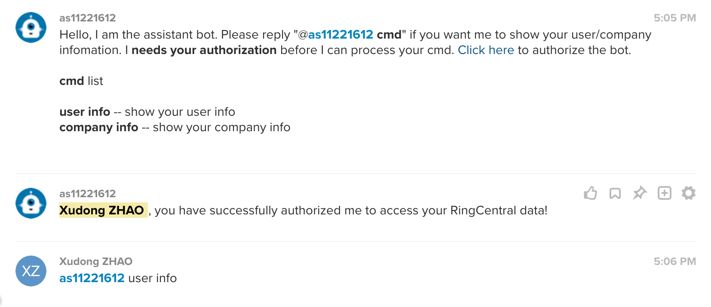

# ringcentral-assistant-bot <!-- omit in toc -->

Assistant Glip bot to help check/set user/company information, Created with [ringcentral-chatbot-framework](https://github.com/zxdong262/ringcentral-chatbot-python) and [ringcentral-chatbot-factory](https://github.com/zxdong262/ringcentral-chatbot-factory-py)

This demo bot shows how to access user data.



## Table of contents <!-- omit in toc -->

- [Prerequisites](#prerequisites)
- [Development & Quick start](#development--quick-start)
- [Test bot](#test-bot)
- [Building and Deploying to AWS Lambda](#building-and-deploying-to-aws-lambda)
- [License](#license)

## Prerequisites

- Python3.6+ and Pip3
- Create the bot App: Login to [developer.ringcentral.com](https://developer.ringcentral.com) and create an `public` `Server/Bot` app with permissions: `ReadAccounts, Edit Extensions, WebhookSubscriptions, Glip`(or more as you may need)
- Create the user App: Login to [developer.ringcentral.com](https://developer.ringcentral.com) and create an `public` `Browser-based` app with permissions: `ReadAccounts, Edit Extensions, WebhookSubscriptions, Glip`(or more as you may need)

## Development & Quick start

```bash

# use virtualenv
pip3 install virtualenv # might need sudo

# init virtual env
virtualenv venv --python=python3

# use env
source ./venv/bin/activate

# install deps
pip install -r requirements.txt
npm i

# run ngrok proxy
# since bot need https server,
# so we need a https proxy for ringcentral to visit our local server
./bin/proxy
# will show:
# Forwarding https://xxxxx.ngrok.io -> localhost:8989

# create env file
cp .sample.env .env

# and goto your ringcentral bot app setting page, set OAuth Redirect URI to https://https://xxxxx.ngrok.io/bot-oauth
# and goto your ringcentral user app setting page, set OAuth Redirect URI to https://https://xxxxx.ngrok.io/user-oauth

# then edit .env, set proper setting,
RINGCENTRAL_BOT_SERVER=https://xxxxx.ngrok.io

## common required
RINGCENTRAL_SERVER=https://platform.devtest.ringcentral.com
RINGCENTRAL_BOT_SERVER=https:xxxxx.ngrok.io

## for bots auth required, from your ringcentral bot app setting page
RINGCENTRAL_BOT_CLIENT_ID=
RINGCENTRAL_BOT_CLIENT_SECRET=

## for user auth, from your ringcentral user app setting page
RINGCENTRAL_USER_CLIENT_ID=
RINGCENTRAL_USER_CLIENT_SECRET=

# create bot logic file
# All bot logic is in config.py, 70 lines only
cp bot-logic.py config.py

# run local dev server
./bin/start
```

## Test bot

- Goto your ringcentral app's bot section, click 'Add to glip'
- Login to [https://glip-app.devtest.ringcentral.com](https://glip-app.devtest.ringcentral.com), find the bot by searching its name. Talk to the bot.
- Edit config.py to change bot bahavior and test in [https://glip-app.devtest.ringcentral.com](https://glip-app.devtest.ringcentral.com)

## Building and Deploying to AWS Lambda

[deploy-to-aws-lambda](https://github.com/zxdong262/ringcentral-chatbot-python/blob/master/docs/deploy-to-aws-lambda.md)

## License

MIT
